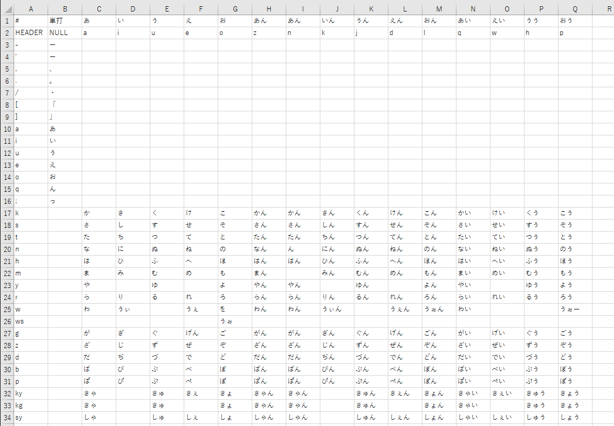

########################################################
romaji_matrix ファイルのフォーマット
########################################################

子音×母音のマトリックスファイル。

サンプルファイル→ `romaji_matrix_AZIK.txt <../sample/romaji_matrix_AZIK.txt>`__

正確には、子音・母音に限らず、
前半と後半のストロークの組み合わせと認識される。

フォーマット
================

- 区切りはタブのテキストファイル
- 文字コードは cp932 (REFACT:引数で融通が利くようにしたい)
- 空行と ``#`` 始まりの行は無視される
- 1列目が ``HEADER`` の行は、母音(後半ストローク)の定義行

  - ``NULL`` と書くとその列は、単打(後半ストロークがない)という意味になる
  - ``HEADER`` 行が複数回出てきてもかまわない (それ以降に適用される)

- それ以降の行

  - 1列目は子音(前半ストローク)の定義
  - 2列目以降は、子音(前半ストローク)と母音(後半ストローク)に対応する結果の「かな」の定義

- ストロークに書けるもの

  - 半角英数記号
  - アルファベットは大文字小文字区別されない。出力上は小文字に寄せられる

- かなに書けるもの

  - 参考: ATOKは内部的には JIS X 0201 のカナ(いわゆる半角カナ) ＋αで格納される
  - 全角ひらがな、全角カタカナ(JIS X 0201に対応するものがあるもの、単独の濁点半濁点、および、濁点半濁点がついた文字)
  - ``ゐヰゑヱ``
  - ``ヵヶゎヮ`` (小書き)
  - 全角記号 ``。「」、・``

tips

- エクセルで作成して、「名前をつけて保存」でファイルの種類「テキスト(タブ区切り)(.txt)」で保存するとよい

制限
===========

- ATOK側の制限で、ローマ字テーブルは550レコードまでらしい。

  - さらにそこには自動的に挿入される定義を含んでなので、実際にマトリックスに書ける定義数は少ない(20ぐらい少ない)

