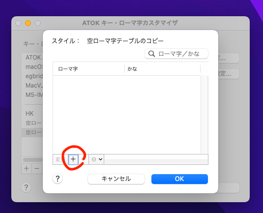

###################################################################
ATOK for Mac のローマ字テーブルへのインポート(流し込み)
###################################################################

ATOK for Mac のローマ字テーブルへ、インポート(流し込み)をするスクリプトです。

ローマ字カスタマイザに、キー入力を送り込むことで実現しています。

- `AZIK_romaji_feed.applescript <../sample/AZIK_romaji_feed.applescript>`__

スクリプト中の ``addRomaji`` コマンドの引数をお好みで変えてお使いください。

使い方
============

あらかじめ、下記の設定を ON にしておく

- システム環境設定 > キーボード > ショートカット > コントロール間のフォーカス移動をキーボードで操作 > ON

スクリプトエディタを起動し、このスクリプトを開く (まだ実行しない)

ATOK キー・ローマ字カスタマイザを起動

ローマ字テーブルが空のスタイルを1つ用意する

- 最初の1回だけ次のようにして、空ローマ字テーブルのスタイルを作成しておくとよい

  - 適当なスタイルをコピー、名前を「空ローマ字テーブル」に変更
  - 「ローマ字設定」ボタンでローマ字テーブルダイアログを表示
  - Tabキーを何度か押して「-」ボタンにフォーカスを当てて、スペースキーを連打すれば連続で削除できる

- 空ローマ字テーブルは空のままキープしておいて、それをコピーして下記の作業を行う

「ローマ字設定」ボタン

Tabキーを何度か押して、「＋」ボタンにフォーカスがある状態にする

IME を OFF (英字入力) にしておく

スクリプトエディタで、このスクリプトを実行
